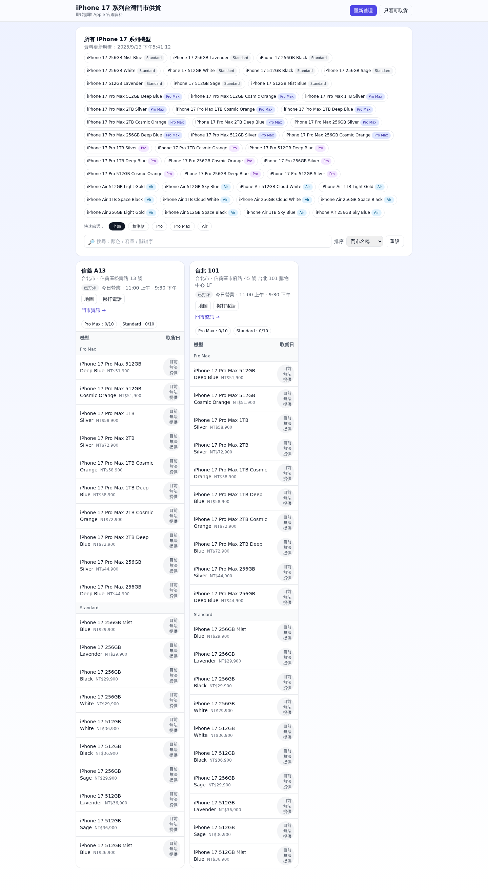

**iPhone Availability: Taiwan Edition (Now With Extra LOLs)**

If you’re hunting iPhone 17 pickup slots across Taiwan and also enjoy software that doesn’t take itself too seriously, you’ve come to the right repo. This Cloudflare Worker scrapes Apple’s public endpoints, caches the results, and serves a slick UI.

Warning: If availability is zero, it’s not a bug — it’s just Apple doing Apple things.

**What This Does**

- Scrapes Apple’s buy pages for iPhone 17 and friends.
- Queries Apple’s fulfillment API for in‑store pickup quotes across Taiwan.
- Caches results in Cloudflare KV and serves a Tailwind UI + JSON API.

**Try It Locally**

- Prereq: Node 18+.
- Install deps: `npm i` (wrangler included).
- Dev server: `npx wrangler dev` (or `npm run dev`).
- Open: `http://127.0.0.1:8787/`

**Deploy**

- One-liner: `npx wrangler deploy`

**Endpoints**

- `/` — UI with availability table and tasteful pixels.
- `/api/availability` — JSON payload of models, stores, and pickup quotes.
  - Default results are served from KV (`source: "kv"`).
  - Add `?force=1` to fetch fresh data now (`source: "fresh"`).

**Config**

Tweak `wrangler.toml` as needed:

- `LOCATION_SEEDS`: `Taiwan,Taipei,Kaohsiung` etc.
- `APPLE_BASE`: Defaults to `https://www.apple.com`.
- `REGION_PATH`: Defaults to `/tw`.
- `FAMILIES`: `iphone-17,iphone-17-pro` by default.

**FAQ (Frequently Amused Questions)**

- “Is this legal?” — We use public pages/APIs and cache responsibly.
- “Why no stock?” — Because everyone else pressed Buy first. Refresh therapy helps.
- “Is it fast?” — Yes. Cloudflare fast. Cheetah-on-rollerblades fast.

Made with ❤️, ☁️, and a suspicious number of `await`s.
